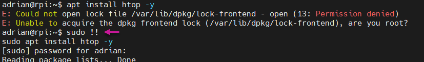

# Linux Security Tricks

### Get open local ports with */proc/net/tcp*
```bash
echo; for port in $(cat /proc/net/tcp | awk '{print $2}' | grep -v "local_address" | awk '{print $2}' FS=":" | sort -u); do echo "[+] Puerto $port -> $((0x$port))"; done | sort -n
```


### Get local IPs with */proc/net/tcp*
In reverse hexadecimal decode order.
```bash
cat /proc/net/tcp
```
```bash
echo "$((0x7F)).$((0x00)).$((0x00)).$((0x01))" ; echo "$((0x7F)).$((0x00)).$((0x00)).$((0x35))" ; echo "$((0x0A)).$((0x00)).$((0x00)).$((0x28))"
```

Same execution on one line.
```bash
echo; for ip_address in $(cat /proc/net/tcp | awk '{print $2}' | grep -v "local_address" | awk '{print $1}' FS=":" | sort -u | sed '1d'); do echo "$ip_address" | tac -rs .. ; done | xargs | tr ' ' '\n' | while read ip; do echo $ip | fold -w2 | { while read byte; do printf "%d." "0x$byte"; done; echo ""; }; done | sed 's/.$//'
```


### Get local IPs with */proc/net/fib_trie*
```bash
echo; cat /proc/net/fib_trie | grep "LOCAL" -B 1 | grep -oP '\d{1,3}.\d{1,3}.\d{1,3}.\d{1,3}' | sort -u | column
```


### Scanning for open ports with *xargs* 
Use 'xargs' as a port scanner with work queue system.
```bash
seq 0 65535 | xargs -P 50 -I {} bash -c 'echo "" > /dev/tcp/10.0.0.40/{} &>/dev/null && echo -e "{} --> open"' 2>/dev/null
```


### Unlock busy ports with *fuser*
Unlock busy ports without knowing the associated process ID.
```bash
lsof -i:8081
fuser -k 8081/tcp
```


### Replace a string in the last command executed
```bash
!!:s/source/replace/
```


### Repeat the last command with root privileges
```bash
sudo !!
```



### Execute previous commands knowing their history number
```bash
history
!3
```


### Generate random number (roll a die)
```bash
shuf -i 1-50 -n 1
shuf -i 10-50 -n 4
```